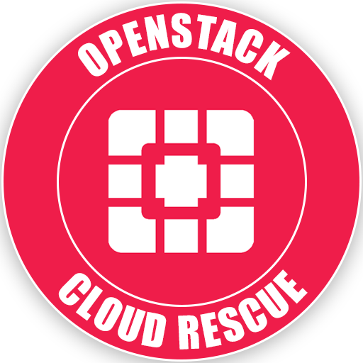

<div id="top"></div>

<!-- PROJECT SHIELDS -->
[![Contributors][contributors-shield]][contributors-url]
[![Forks][forks-shield]][forks-url]
[![Stargazers][stars-shield]][stars-url]
[![Issues][issues-shield]][issues-url]
[![MIT License][license-shield]][license-url]
[![LinkedIn][linkedin-shield]][linkedin-url]


<!-- PROJECT LOGO -->
<br />
<div align="center">
  <a href="https://github.com/linitio/openstack-cloud-rescue-image">
    
  </a>

<h3 align="center">OpenStack Cloud Rescue</h3>

  <p align="center">
    Open source cloud image for rescuing cloud instances on OpenStack platforms.
    <br />
    <a href="https://github.com/linitio/openstack-cloud-rescue-image/wiki"><strong>Explore the docs »</strong></a>
    <br />
    <br />
    <a href="https://github.com/linitio/openstack-cloud-rescue-image/issues">Report Bug</a>
    ·
    <a href="https://github.com/linitio/openstack-cloud-rescue-image/issues">Request Feature</a>
  </p>
</div>

<!-- ABOUT THE PROJECT -->
## About The Project

This cloud-ready image is based on Ubuntu 22.04 LTS. On top of the base operating system, this image integrates several troubleshooting packages such as curl, dnsutils, ncdu, mdadm and more. This image is primarily meant to be used with OpenStack's rescue mode.


<p align="right">(<a href="#top">back to top</a>)</p>

<!-- GETTING STARTED -->
## Getting Started

This is an example of how you may give instructions on setting up your project locally.
To get a local copy up and running follow these simple example steps.

### How to use this image

1. Set your OpenStack environment variables
2. Download the latest image from [release page](https://github.com/linitio/openstack-cloud-rescue-image/releases "Release page")
3. Upload image to your OpenStack environment
   ```sh
   openstack image create --disk-format=qcow2 --container-format=bare --file cloud-rescue-xxxx.xxxxxx.x-x86_64.qcow2  'OpenStack Cloud Rescue'
   ```
4. Start your instance in rescue mode, specifying the rescue image id
   ```sh
   openstack server rescue --image RESCUE_IMAGE_ID INSTANCE_ID
   ```
   If you want to use password authentication, add --password
   ```sh
   openstack server rescue --image RESCUE_IMAGE_ID --password YOUR_PASSWORD INSTANCE_ID
   ```
5. You can now logging via SSH (with public key or password) or VNC console.  
The default user is **rescue-user**
   
6. Once done, turn off rescue mode
   ```sh
   openstack server unrescue INSTANCE_ID
   
<p align="right">(<a href="#top">back to top</a>)</p>

<!-- CONTRIBUTING -->
## Contributing

Contributions are what make the open source community such an amazing place to learn, inspire, and create. Any contributions you make are **greatly appreciated**.

If you have a suggestion that would make this better, please fork the repo and create a pull request. You can also simply open an issue with the tag "enhancement".
Don't forget to give the project a star! Thanks again!

1. Fork the Project
2. Create your Feature Branch (`git checkout -b feature/AmazingFeature`)
3. Commit your Changes (`git commit -m 'Add some AmazingFeature'`)
4. Push to the Branch (`git push origin feature/AmazingFeature`)
5. Open a Pull Request

<p align="right">(<a href="#top">back to top</a>)</p>


<!-- LICENSE -->
## License

Distributed under the GPL-3.0 License. See `LICENSE.md` for more information.

<p align="right">(<a href="#top">back to top</a>)</p>


<!-- CONTACT -->
## Contact

Kevin Allioli - [@linit_io](https://twitter.com/linit_io) - kevin@linit.io

Project Link: [https://github.com/linitio/openstack-cloud-rescue-image](https://github.com/linitio/openstack-cloud-rescue-image)

<p align="right">(<a href="#top">back to top</a>)</p>


<!-- MARKDOWN LINKS & IMAGES -->
<!-- https://www.markdownguide.org/basic-syntax/#reference-style-links -->
[contributors-shield]: https://img.shields.io/github/contributors/linitio/openstack-cloud-rescue-image.svg?style=for-the-badge
[contributors-url]: https://github.com/linitio/openstack-cloud-rescue-image/graphs/contributors
[forks-shield]: https://img.shields.io/github/forks/linitio/openstack-cloud-rescue-image.svg?style=for-the-badge
[forks-url]: https://github.com/linitio/openstack-cloud-rescue-image/network/members
[stars-shield]: https://img.shields.io/github/stars/linitio/openstack-cloud-rescue-image.svg?style=for-the-badge
[stars-url]: https://github.com/linitio/openstack-cloud-rescue-image/stargazers
[issues-shield]: https://img.shields.io/github/issues/linitio/openstack-cloud-rescue-image.svg?style=for-the-badge
[issues-url]: https://github.com/linitio/openstack-cloud-rescue-image/issues
[license-shield]: https://img.shields.io/github/license/linitio/openstack-cloud-rescue-image.svg?style=for-the-badge
[license-url]: https://github.com/linitio/openstack-cloud-rescue-image/blob/master/LICENSE.txt
[linkedin-shield]: https://img.shields.io/badge/-LinkedIn-black.svg?style=for-the-badge&logo=linkedin&colorB=555
[linkedin-url]: https://linkedin.com/in/kevinallioli
